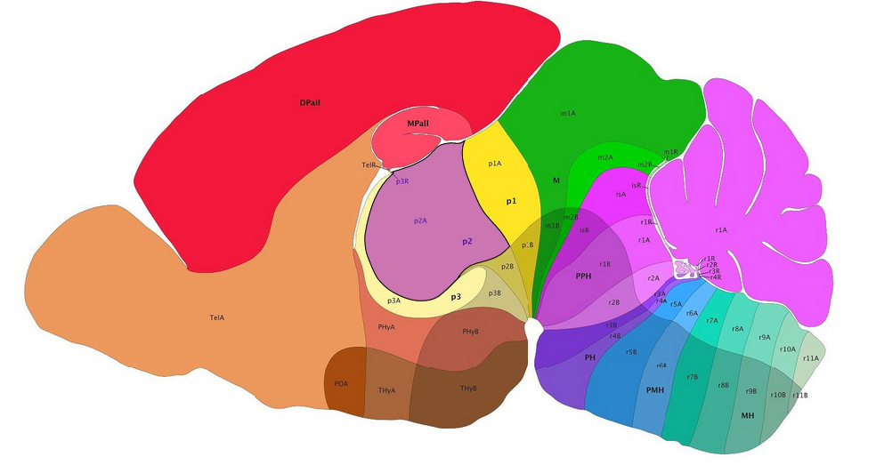
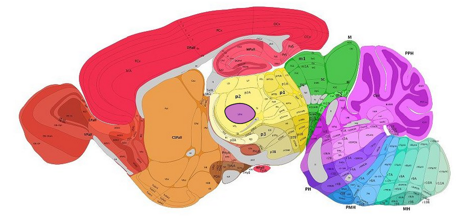
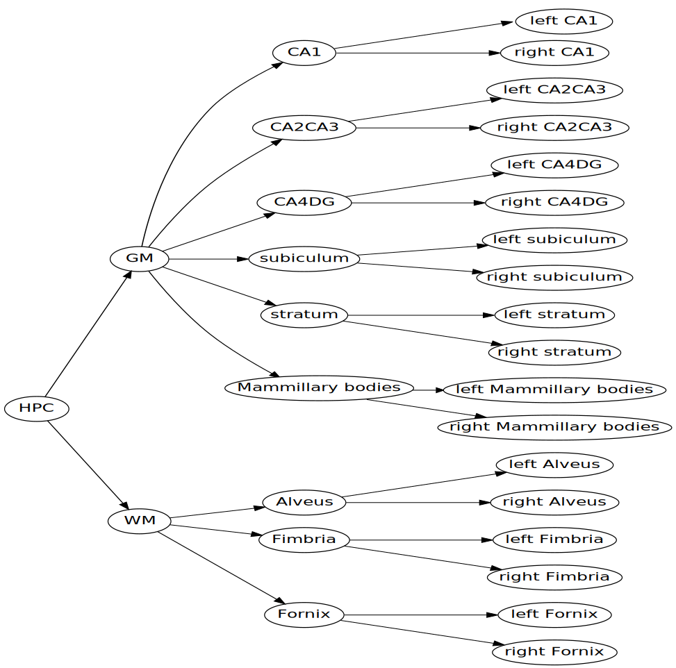
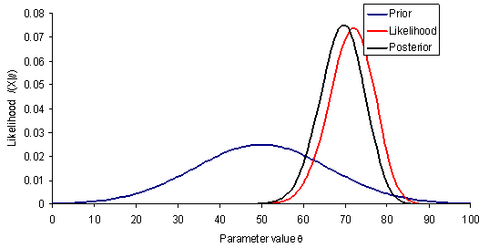
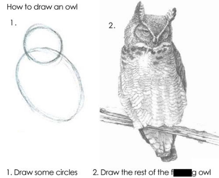
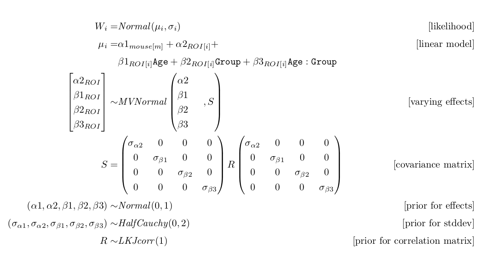
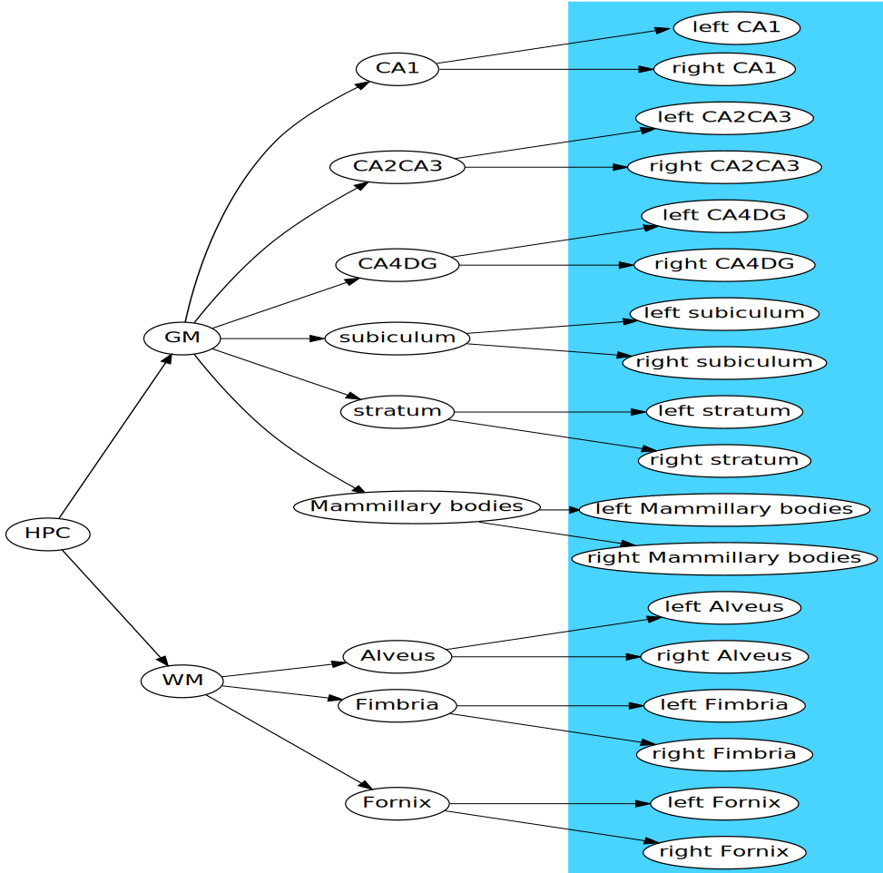
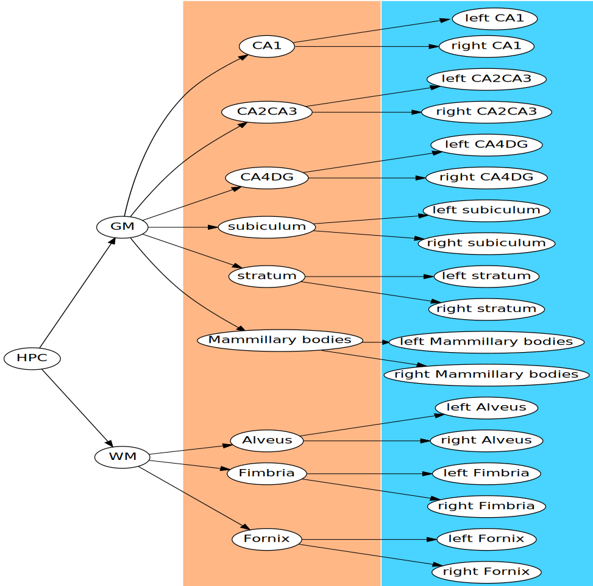
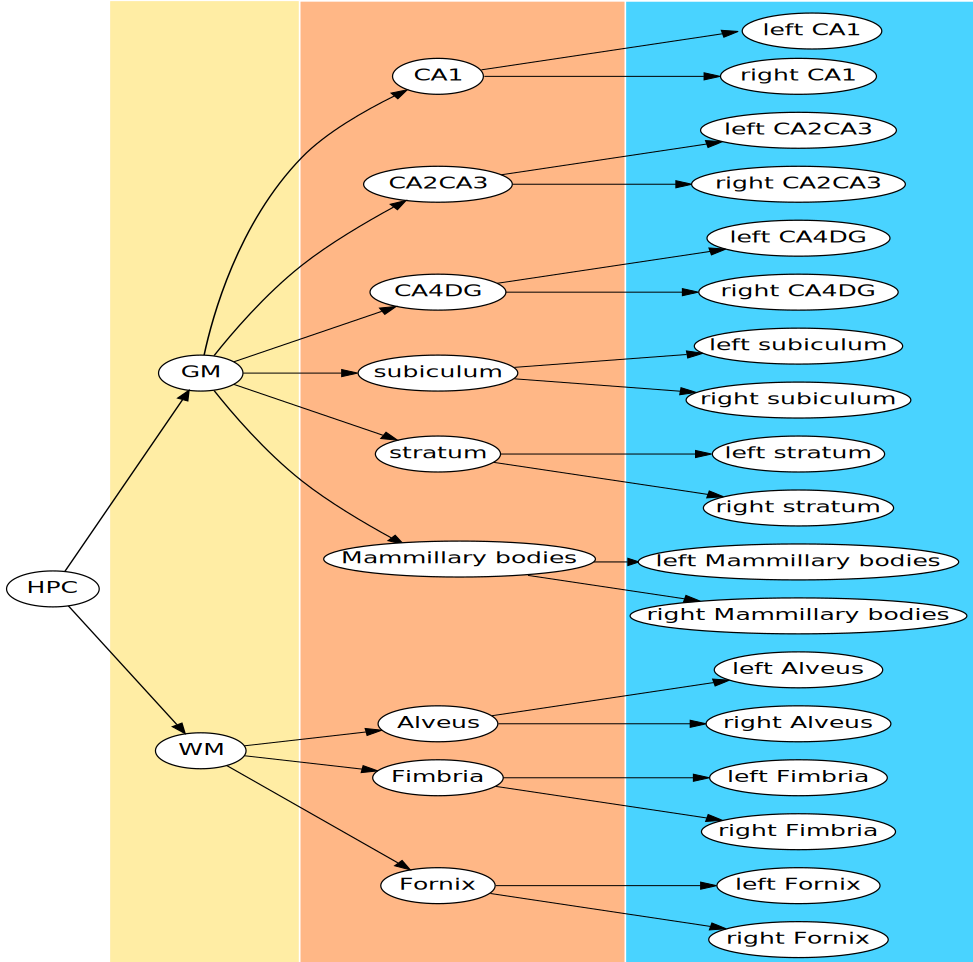
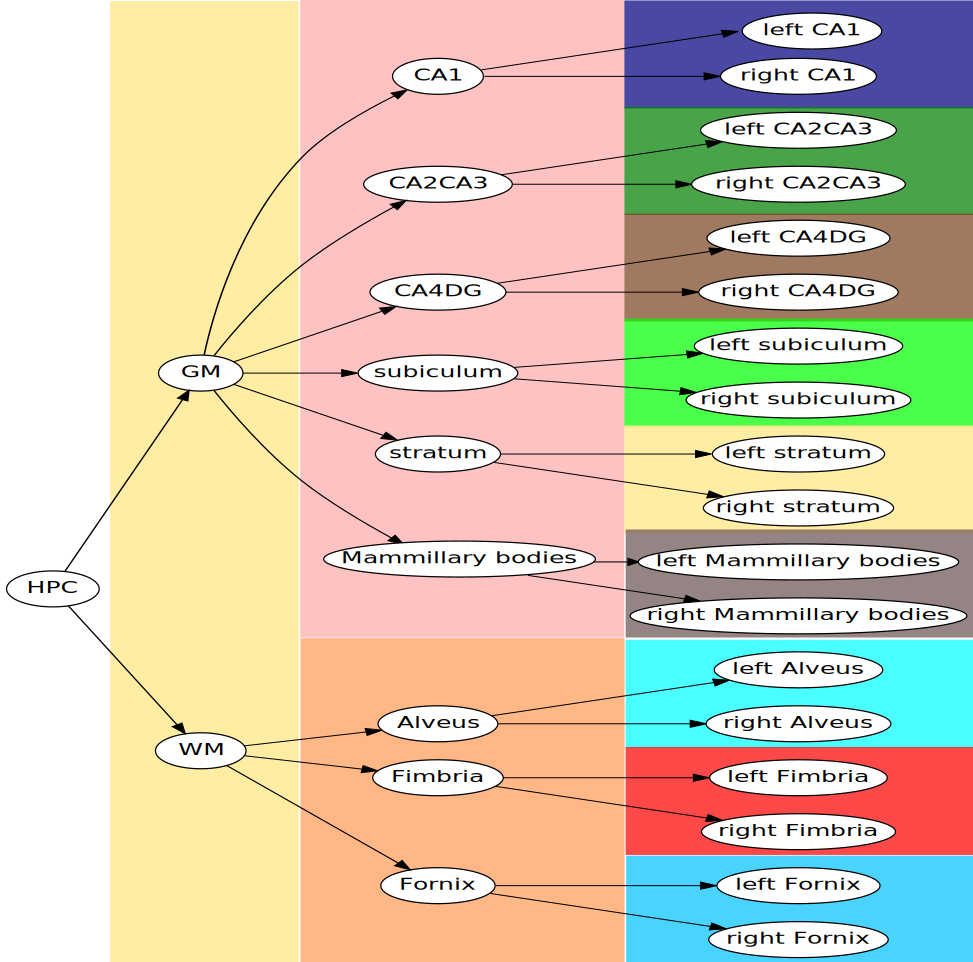

<style>
.remark-code { 
  font-size: 75%;
}

.remark-slide-scaler {
  overflow: scroll;
}

.small {
  font-size: 65%;
}

.remark-slide-number {
  font-size: 10pt;
  margin-bottom: -11.6px;
  margin-right: 10px;
  color: #FFFFFF; /* white */
  opacity: 1; /* default: 0.5 */
}
</style>


```{r setup, include=FALSE}
options(htmltools.dir.version = FALSE)
library(knitr)
opts_chunk$set(dpi=200, fig.height=5.5, fig.width=10)
#opts_chunk$set(tidy.opts=list(width.cutoff=60),tidy=TRUE)
```

# Brain Organization

Growth and differentiation



The Allen P14 developing mouse brain atlas.

---

# Brain Organization

Growth and differentiation



The Allen P56 developing mouse brain atlas.

---

# Brain Mapping

How do we chunk the brain into regions?

- Ontology
- Histology
- Gene Expression
- Function

Dorr

---

# Higher levels

Can the regions themselves be chunked into regions?

```{r, out.height = "400px", echo = FALSE}

```

---

# What does this give us?

The hierarchy tree can be viewed as a claim about expected similarity. Voxels
that share a region ought to be more similar to one another than voxels in
adjacent regions. Voxels in adjacent regions ought to be more similar than
voxels is distant regions.

---
class: center

# How can we use this to our advantage?

By reaching for statistics that allow us to incorporate prior knowledge
we can leverage our beliefs about the hierarchical structure of the brain.

---
class: center

# How can we use this to our advantage?

By reaching for statistics that allow us to incorporate prior knowledge
we can leverage our beliefs about the hierarchical structure of the brain.

Enter Bayes.

---

# A quick refresher

- Bayes noticed this useful property for the probabilities for two events "A" and "B"

$$ \color{red}{P(A | B)} = \frac{{\color{blue}{P(B | A)}\color{orange}{P(A)}}}{\color{magenta}{P(B)}} $$
- $\color{red}{P(A|B)}$: The probability of A given that B happened
- $\color{blue}{P(B|A)}$: The probability of B given that A happened
- $\color{orange}{P(A)}$: The probability of A
- $\color{magenta}{P(B)}$: the probability of B

- Bayes did this in the context of the binomial distribution

---
class: middle

# Bayes' Theorem Redux

$$ \color{red}{P(\theta | D)} = \frac{{\color{blue}{P(D | \theta)}\color{orange}{P(\theta)}}}{\color{magenta}{\int P(D | \theta)P(\theta)d\theta}} $$

**Posterior**: $\color{red}{P(\theta|D)}$: 

the probability of our parameters given our data

**Likelihood**: $\color{blue}{P(D|\theta)}$

The probability of our data given our parameters

**Prior**: $\color{orange}{P(\theta)}$

The probability of our parameters before we saw the data 

**Normalizing Constant**: $\color{magenta}{\int P(D | \theta)P(\theta)d\theta}$

The probability of the data averaged over all possible parameter sets

---
class: middle

# Bayes' Theorem Redux

$$ \color{red}{P(\theta | D)} \propto \color{orange}{P(\theta)}\color{blue}{P(D | \theta)}$$

**Posterior**: $\color{red}{P(\theta|D)}$: 

the probability of our parameters given our data

**Prior**: $\color{orange}{P(\theta)}$

The probability of our parameters before we saw the data 

**Likelihood**: $\color{blue}{P(D|\theta)}$

The probability of our data given our parameters

---

# In words

$$ \color{red}{P(\theta | D)} \propto \color{orange}{P(\theta)}\color{blue}{P(D | \theta)}$$

The <font color="red">probability of parameters given our data</font> is proportional to <font color="orange">how probable we
thought they were before</font> adjusted by <font color="blue">how well they agree with the data we saw</font>.



---
class: center

# Learning Bayesian Statistics



---
class: middle

# Here's Bayes' theorem

$$ \color{red}{P(\theta | D)} = \frac{{\color{blue}{P(D | \theta)}\color{orange}{P(\theta)}}}{\color{magenta}{\int P(D | \theta)P(\theta)d\theta}} $$

---
class: center

# Run this model



---

# Building up

We'll start with and "lmer" model

`y ~ genotype + (genotype | structure)`

---

# Building up

We'll start with and "lmer" model

`y ~ genotype + (genotype | structure)`

We're estimating an intercept and effect of genotype across all
structures, plus a little adjustment to the intercept and genotype
for each structure.

---

# Building up

Convert it to an equational representation

$$ y = \color{CadetBlue}{\alpha} + 
   X\color{LimeGreen}{\beta} + Z\color{orange}{b} + \epsilon $$

where

1. $\color{CadetBlue}{\alpha}$ is our intercept
1. $X$ is our model matrix (a 1-column matrix with genotype = 0 or 1)
1. $\color{LimeGreen}{\beta}$ is our genotype effect
1. $Z$ is the hardest to explain (black-board break).
1. $\color{orange}{b}$ is vector of the the random effects of both genotype and 
   intercept all stuck together.
1. $\epsilon$ is our residual.

---

# Reinterpetting Lmer as a bayesian model

In a bayesian model each parameter needs a prior. Lme4 gives explicit
priors to $b$ and $\epsilon$

1. $\epsilon \sim \mathcal{N}(0, \sigma^2)$
1. $\color{orange}{b} \sim \mathcal{N}(\mathbf{0}, \Sigma)$

   where $\Sigma$ is a covariance matrix for the random effects. This is
   a block diagonal matrix, i.e. the covariance between coefficients at
   each structure is the same.

   So that leaves:

1. $\color{CadetBlue}{\alpha} \sim \mathcal{U}(-\infty, \infty)$
1. $\color{LimeGreen}{\beta} \sim \mathcal{U}(-\infty, \infty)$
1. $\sigma \sim \mathcal{U}(0, \infty)$
1. $\Sigma \sim \mathcal{U}(0, \infty)$

---

# Is this good enough?

Imagining `lmer` as a bayesian model indicates some problems

1. **Uniform priors**. Uniform priors are (almost) never a good idea. for example
   if our data ranges between 0 - 10, a variance of 10^9 isn't going to happen.
   If our largest observation is 100, our group difference probably isn't
   5000. 
1. **Point estimates**. Lmer only returns the most probably values of the parameters,
   uncertainty can be approximated, but only poorly.
   
Contrasted with 

1. **Informative priors**. Constrain effects to reasonable levels.
1. **Full Posterior**. You get a distribution for each parameter, so you know
   exactly how uncertain it is. 
   
---

# Intuition behind the bayesian lmer

The key term is *shrinkage* or *regularization*. 

In the bayesian lmer we say no to uniform priors.

1. $\color{CadetBlue}{\alpha} \sim \mathcal{N}(0, 1)$ 
1. $\color{LimeGreen}{\beta} \sim \mathcal{N}(0, 1)$ 

This says we don't expect our parameters to be really big, this shrinks
our estimates of them toward zero.

The parameter $\color{orange}{b}$ can be seen as the difference between the overall mean
effects and the structure specific effects. By placing a prior on these
we regularize or shrink our structure specific parameters toward the
mean.

So we're saying: we don't expect our mean effects to be too large, and
we don't expect the structure specific effects to be very different from
the mean.

---
class: center

# Extending this idea to the hierarchy tree

<code class="remark-inline-code"></br>&zwnj;</code>

```{r, out.height = "400px", echo = FALSE}

```

---
class: center

# Extending this idea to the hierarchy tree

`y ~ genotype + (genotype | structure) + (1 | ID)`
<code class="remark-inline-code"></br>&zwnj;</code>

```{r, out.height = "400px", echo = FALSE}

```

---
class: center

# Extending this idea to the hierarchy tree

`y ~ genotype + (genotype | structure) + (genotype | parent) + (1 | ID)`

```{r, out.height = "400px", echo = FALSE}

```

---
class: center

# Extending this idea to the hierarchy tree

`y ~ genotype + (genotype | structure) + (genotype | parent) + (genotype | grandparent) + (1 | ID)`

```{r, out.height = "400px", echo = FALSE}

```

---
class: center

# Extending this idea to the hierarchy tree

<code class="remark-inline-code"></br>&zwnj;</code>

```{r, out.height = "400px", echo = FALSE}

```

## The effect diffusion tree

- This model cannot be specified in `rstanarm` or `brms`
- custom model implemented in stan
- Effects at children are gaussian draws centered at their parents,
  diffuse down the tree.
