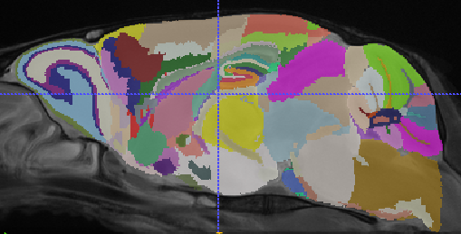
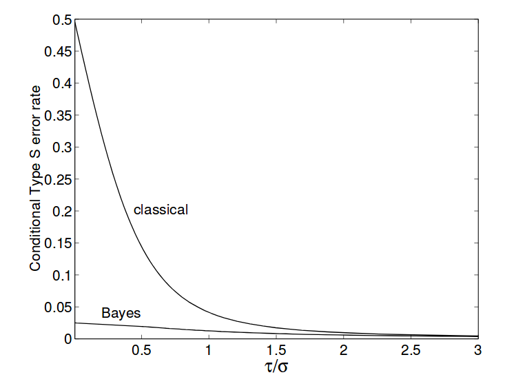
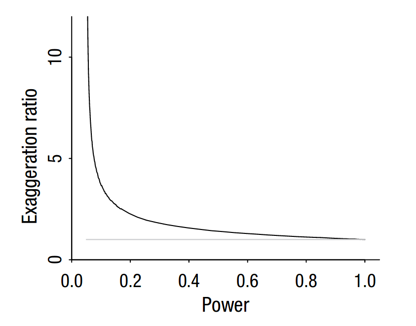

class: middle, center

<style>
.remark-code { 
  font-size: 75%;
}

.remark-slide-scaler {
  overflow: scroll;
}

.small {
  font-size: 65%;
}

.remark-slide-number {
  font-size: 10pt;
  margin-bottom: -11.6px;
  margin-right: 10px;
  color: #FFFFFF; /* white */
  opacity: 1; /* default: 0.5 */
}
</style>


```{r setup, include=FALSE}
options(htmltools.dir.version = FALSE)
library(knitr)
opts_chunk$set(dpi=200, fig.height=5.5, fig.width=10)
#opts_chunk$set(tidy.opts=list(width.cutoff=60),tidy=TRUE)
```

```{r, out.height = "580px", echo = FALSE}

```

---
class: middle, center

```{r, out.height = "580px", echo = FALSE}

```

---

# Brain Organization

&zwnj;

```{r, out.height = "380px", out.width = "600px", echo = FALSE}

```

---

# Brain Organization

Growth and differentiation

```{r, out.height = "380px", out.width = "600px", echo = FALSE}
knitr::include_graphics("p56.png")
```

The Allen P56 developing mouse brain atlas.

---

# Brain Organization

Growth and differentiation

```{r, out.height = "380px", out.width = "600px", echo = FALSE}
knitr::include_graphics("p14.png")
```

The Allen P14 developing mouse brain atlas.

---

# Brain Mapping

How do we chunk the brain into regions?

- Development
- Histology
- Gene Expression
- Function

---

# Higher levels

Can the regions themselves be chunked into regions?

```{r, out.height = "400px", echo = FALSE}
knitr::include_graphics("hippocampal_tree.svg")
```

---

# What does this give us?

The hierarchy tree can be viewed as claim about expected similarity. 

- Voxels that share a region ought to be more similar to one another than voxels in
adjacent regions. 
- Voxels in adjacent regions ought to be more similar than voxels is distant regions.
- Parent structures should be most similar to their children
- Parent structures should be similar to their neighbours

---

# How can we use this to our advantage?

- Use statistics that allow us to incorporate prior knowledge
- Leverage our beliefs about the hierarchical structure of the brain
- Get better parameter estimates
- Avoid overfitting

---

# How can we use this to our advantage?

- Use statistics that allow us to incorporate prior knowledge
- Leverage our beliefs about the hierarchical structure of the brain
- Get better parameter estimates
- Avoid overfitting

Enter Bayes.

---

# A quick refresher

- Bayes noticed this useful property for the probabilities for two events "A" and "B"

$$ \color{red}{P(A | B)} = \frac{{\color{blue}{P(B | A)}\color{orange}{P(A)}}}{\color{magenta}{P(B)}} $$
- $\color{red}{P(A|B)}$: The probability of A given that B happened
- $\color{blue}{P(B|A)}$: The probability of B given that A happened
- $\color{orange}{P(A)}$: The probability of A
- $\color{magenta}{P(B)}$: the probability of B

- Bayes did this in the context of the binomial distribution

---
class: middle

# Bayes' Theorem Redux

$$ \color{red}{P(\theta | D)} = \frac{{\color{blue}{P(D | \theta)}\color{orange}{P(\theta)}}}{\color{magenta}{\int P(D | \theta)P(\theta)d\theta}} $$

**Posterior**: $\color{red}{P(\theta|D)}$: 

the probability of our parameters given our data

**Likelihood**: $\color{blue}{P(D|\theta)}$

The probability of our data given our parameters

**Prior**: $\color{orange}{P(\theta)}$

The probability of our parameters before we saw the data 

**Normalizing Constant**: $\color{magenta}{\int P(D | \theta)P(\theta)d\theta}$

The probability of the data averaged over all possible parameter sets

---
class: middle

# Bayes' Theorem Redux

$$ \color{red}{P(\theta | D)} \propto \color{orange}{P(\theta)}\color{blue}{P(D | \theta)}$$

**Posterior**: $\color{red}{P(\theta|D)}$: 

the probability of our parameters given our data

**Prior**: $\color{orange}{P(\theta)}$

The probability of our parameters before we saw the data 

**Likelihood**: $\color{blue}{P(D|\theta)}$

The probability of our data given our parameters

---

# In words

$$ \color{red}{P(\theta | D)} \propto \color{orange}{P(\theta)}\color{blue}{P(D | \theta)}$$

The <font color="red">probability of parameters given our data</font> is proportional to <font color="orange">how probable we
thought they were before</font> adjusted by <font color="blue">how well they agree with the data we saw</font>.


---

# Why is this great?

- Posterior distributions are much easier to work with than asymptotic distributions
  in frequentist statistics
- Easy to compute posterior weighted averages
- If I have posterior samples for group 1 and group 2, I can generate posterior
  distributions for the sum, difference, or product of the two groups.
- Can do interesting things like posterior weighted costs.

---
class: center

# Learning Bayesian Statistics


---
class: middle

# Here's Bayes' theorem

$$ \color{red}{P(\theta | D)} = \frac{{\color{blue}{P(D | \theta)}\color{orange}{P(\theta)}}}{\color{magenta}{\int P(D | \theta)P(\theta)d\theta}} $$

---
class: center

# Run this model


---

# Building up

We'll start with an "lmer" model

`y ~ genotype + (genotype | structure)`

---

# Building up

We'll start with an "lmer" model

`y ~ genotype + (genotype | structure)`

We're estimating an intercept and effect of genotype across all
structures, plus a little adjustment to the intercept and genotype
for each structure.

---

# Building up

Convert it to an equational representation

$$y_{is} = \color{CadetBlue}{\alpha} + x_{i}\color{LimeGreen}{\beta} + Z_{i}\color{orange}{b_s} + \epsilon_{is}$$

where

1. $\color{CadetBlue}{\alpha}$ is our intercept
1. $x_i$ is our model matrix (a 1-column matrix with genotype = 0 or 1)
1. $\color{LimeGreen}{\beta}$ is our genotype effect
1. $Z_i$ is a vector with (1 for the intercept, and the subject's genotype)
1. $\color{orange}{b_s}$ is vector of the the random effects of both genotype and 
   intercept at structure s.
1. $\epsilon$ is our residual.

---

# Reinterpeting Lmer as a bayesian model

In a bayesian model each parameter needs a prior. Lme4 gives explicit
priors to $b$ and $\epsilon$

1. $\epsilon \sim \mathcal{N}(0, \sigma^2)$
1. $\color{orange}{b_s} \sim \mathcal{N}(\mathbf{0}, \Sigma)$

   where $\Sigma$ is a covariance matrix for the random effects. This is
   a block diagonal matrix, i.e. the covariance between coefficients at
   each structure is the same.

   So that leaves:

1. $\color{CadetBlue}{\alpha} \sim \mathcal{U}(-\infty, \infty)$
1. $\color{LimeGreen}{\beta} \sim \mathcal{U}(-\infty, \infty)$
1. $\sigma \sim \mathcal{U}(0, \infty)$
1. $\Sigma \sim \mathcal{U}(0, \infty)$

---

# Is this good enough?

Imagining `lmer` as a bayesian model indicates some problems

1. **Uniform priors**. Uniform priors are (almost) never a good idea. for example
   if our data ranges between 0 - 10, a variance of 10^9 isn't going to happen.
   If our largest observation is 100, our group difference probably isn't
   5000. 
1. **Point estimates**. Lmer only returns the most probably values of the parameters,
   uncertainty can be approximated, but only poorly.
   
Contrasted with 

1. **Informative priors**. Constrain effects to reasonable levels.
1. **Full Posterior**. You get a distribution for each parameter, so you know
   exactly how uncertain it is. 
   
---

# How do I?

Take your `lmer` and prefix it with `stan_`

change

```{r, eval = FALSE}
lmer(y ~ genotype + (genotype | structure), data = gf)
```

to

```{r, eval = FALSE}
stan_lmer(y ~ genotype + (genotype | structure), data = gf)
```

And you get to start calling yourself a bayesian!
   
---

# Intuition behind the bayesian lmer

The key term is *shrinkage* or *regularization*. 

In the bayesian lmer we say no to uniform priors.

1. $\color{CadetBlue}{\alpha} \sim \mathcal{N}(0, 1)$ 
1. $\color{LimeGreen}{\beta} \sim \mathcal{N}(0, 1)$ 

- We don't expect our parameters to be really big
- this shrinks our estimates of them toward zero.
- $\color{orange}{b_s}$ is the difference between the overall mean
effects and the structure specific effects
- By placing a prior on $\color{orange}{b_s}$ shrinks 
  our structure specific parameters toward the mean.

So we're saying: we don't expect our mean effects to be too large, and
we don't expect the structure specific effects to be very different from
the mean.

---
class: center

# Extending this idea to the hierarchy tree

<code class="remark-inline-code"></br>&zwnj;</code>

```{r, out.height = "400px", echo = FALSE}
knitr::include_graphics("hippocampal_tree.svg")
```

---
class: center

# Extending this idea to the hierarchy tree

`y ~ genotype + (genotype | structure) + (1 | ID)`
<code class="remark-inline-code"></br>&zwnj;</code>

```{r, out.height = "400px", echo = FALSE}
knitr::include_graphics("hippocampal_tree_first_level.svg")
```

---
class: center

# Extending this idea to the hierarchy tree

`y ~ genotype + (genotype | structure) + (genotype | parent) + (1 | ID)`

```{r, out.height = "400px", echo = FALSE}
knitr::include_graphics("hippocampal_tree_second_level.svg")
```

---
class: center

# Extending this idea to the hierarchy tree

`y ~ genotype + (genotype | structure) + (genotype | parent) + (genotype | grandparent) + (1 | ID)`

```{r, out.height = "400px", echo = FALSE}
knitr::include_graphics("hippocampal_tree_third_level.svg")
```

---
class: center

# Extending this idea to the hierarchy tree

<code class="remark-inline-code"></br>&zwnj;</code>

```{r, out.height = "400px", echo = FALSE}
knitr::include_graphics("hippocampal_tree_hierarchical.svg")
```

---

# The effect diffusion tree

- This model cannot be specified in 
  1. `rstanarm` 
  1. `brms`
  1. `rethinking`
- custom model implemented in stan
- Effects at children are gaussian draws centered at their parents,
  diffuse down the tree.
- Effects at child structures shrink toward their parent

---

# So how does it do?

- Glib answer: slower. Mostly due to not being optimized.
- Serious answer: this is a subtle question.

---

# How do we evaluate model performance?

- Do we care about long run behaviour?
  - Evaluate predictive performance
  - Compare stability across replication datasets
- Do we know the true answer?
  - Compare against ground truth
  - Assess power
  
Disclaimer: so far I have only simulated a handful of simple cases

---

```
## # A tibble: 18 x 10
##      snr hier_eff mean_eff  noise model   cor  elpd    llb logLik   mse
##    <dbl> <lgl>       <dbl>  <dbl> <chr> <dbl> <dbl>  <dbl>  <dbl> <dbl>
##  1 0.500 F          0.0699 0.140  edt    1.22  -549 -5.34  -1.08  0.775
##  2 0.500 F          0.0699 0.140  hlmer  1.26  -549 -4.12  -1.08  0.775
##  3 0.500 F          0.0699 0.140  lmer   1.25  -548 -4.23  -1.07  0.775
##  4 0.500 T          0.0824 0.165  edt    1.83  -546 -0.523 -1.03  0.748
##  5 0.500 T          0.0824 0.165  hlmer  1.70  -548 -1.99  -1.03  0.777
##  6 0.500 T          0.0824 0.165  lmer   1.74  -547  1.54  -1.03  0.759
##  7 1.00  F          0.0820 0.0820 edt    2.39  -491 -4.10  -0.895 0.540
##  8 1.00  F          0.0820 0.0820 hlmer  2.28  -493 -2.30  -0.897 0.551
##  9 1.00  F          0.0820 0.0820 lmer   2.29  -492  0.174 -0.895 0.541
## 10 1.00  T          0.0842 0.0842 edt    2.42  -493 -5.10  -0.918 0.554
## 11 1.00  T          0.0842 0.0842 hlmer  1.72  -495 -1.57  -0.918 0.556
## 12 1.00  T          0.0842 0.0842 lmer   1.69  -494 -1.08  -0.917 0.554
## 13 2.00  F          0.121  0.0603 edt    2.86  -408 -5.28  -0.686 0.348
## 14 2.00  F          0.121  0.0603 hlmer  1.76  -409 -0.893 -0.686 0.349
## 15 2.00  F          0.121  0.0603 lmer   1.75  -408 -0.490 -0.685 0.349
## 16 2.00  T          0.0831 0.0416 edt    2.77  -359 -6.01  -0.535 0.269
## 17 2.00  T          0.0831 0.0416 hlmer  1.99  -359 -1.23  -0.535 0.269
## 18 2.00  T          0.0831 0.0416 lmer   2.00  -358 -0.950 -0.535 0.269
```

---

# Predictive Performance

Comparing (approximate) leave-one-out cross-validation shows
the horizontal and diffusion tree priors performing identically.
This suggests the data is strong enough to override the prior
on overall model fit in both cases.

---

# Against ground truth

- The diffusion tree has slightly superior simulated effect recapture. 
- The diffusion tree has broader posterior distributions, it is less
  certain of its answers.
  
Seems to be a trade-off between certainty and recapture. But very
early days in the analysis.

---

# To Do

- **Compare replication data sets.** Fit both models against
  two or more studies that estimate a common effect. Compare
  how similar the results are across the data sets.
- **Assess power and false-discovery rates.**

---

# Assessing Power

- We want to compare the power and false discovery of:
  1. The start mass-univariate approach
  1. Flat random effects
  1. Layered random effects
  1. Effect diffusion tree
- Requires unifying frequentist and bayesian hypothesis testing
- Type S and Type M error rates.
- Approach pioneered by Gelman and Tuerlinckx, with a nice Gelman and Rubin review in 2014
- Key abstraction: "claims with confidence"

---

# Claims with confidence

- In frequentism, a confidence interval that doesn't bound zero is a claim with confidence
  that the result is non-zero
- In bayesianism, the equivalent posterior credible interval not bounding zero is a claim
  with confidence that the result is non zero.
  
- Type S (sign) error: A claim with confidence is made when the estimate has a different
  sign than the true effect (this is *NOT* a type I error).
- Type M (magnitude) error: A claim with confidence is made, the effect in concluded to
  be large when in fact it is small.
  
---

# Type S

- Gelman and Tuerlinckx show that at low SNR standard frequentist inference can have type S
  error rates as high as 50%

```{r, out.height = "380px", out.width = "600px", echo = FALSE}

```

---

# Type M

- Gelman and Rubin show that effects in low power studies are greatly exaggerated

```{r, out.height = "380px", out.width = "600px", echo = FALSE}

```

---
class: middle

# Questions?
